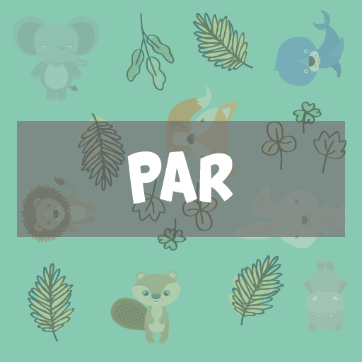
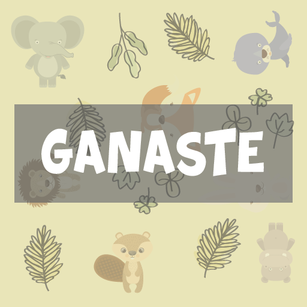
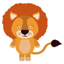
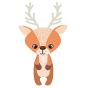
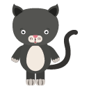
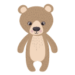
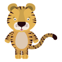
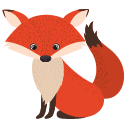

El desarrollo de juegos puede ser inicialmente algo complejo debido a que se requiere múltiples skills de programación, diseño y narrativa por lo que suele ser acojonante empezar en este mundo. Sin embargo, resulta ser fácil si ya se tienen bases de programación y se utilizan las librerías adecuadas para iniciarse.

**Pygame es un conjunto de módulos Python diseñados para el desarrollo de videojuegos** o cualquier otra aplicación multimedia,  portable y multiplataforma bajo la licencia LGPL. En efecto, permite el desarrollo de juegos en dos dimensiones (2D), fácil de entender y amigable siendo ideal para iniciar con el desarrollo de juegos.

## Programando un juego con pygame

Para tener una mejor perspectiva y entendimiento de esta biblioteca es fundamental desarrollar un video juego, por lo que el único prerrequisito es conocer python. 

En tal sentido, el juego que programaremos será el conocido memoria, para fines prácticos lo denominaremos **ZOO Memoria** porque usaremos imagenes de animales. Este consiste en un tablero con 16 cuadros en total, de 4 filas y 4 columnas en primera instancia las imágenes están ocultas, pero existen 8 figuras de animales donde cada uno tiene una copia es decir una pareja, el objetivo es encontrar la figura del animal junto a su pareja en la menor cantidad de intentos posibles. Qué mejor que un video para explicar el juego.


Para elaborar el juego de la forma ordenada y gradual para su mejor entendimiento dividiremos todo el proceso de desarrollo en 9 tareas.

## Tarea 1 Configurar el proyecto

Para empezar debemos descargar e instalar Python desde [https://www.python.org/downloads/](https://www.python.org/downloads/) de acuerdo a nuestro sistema operativo. Una vez instalado, se desde la consola de comandos ya podemos instalar pygame usando el administrador de paquetes de python (PIP).
```sh
pip install pygame
```
Una vez realizada la instalación, desde el IDE de nuestra preferencia creamos tres archivos python y un folder denominado assets para almacenar nuestras imagenes.
* app.py
* animal.py
* config.py
*  ./assets

 




* ./assets/animals
 
       

Es importante respetar la dimensión de las imágenes para luego hacer fácil la lógica que se agregara en los pasos posteriores.  

## Tarea 2  Inicializar el Game Loop
Pygame permite la inicialización y la creación del game loop de una forma sumamente sencilla con unas cuantas líneas de código. 

En **app.py** (version 1)
```js
import pygame

    # Inicializar Pygame
pygame.init()
    # Asignamos un título al juego
pygame.display.set_caption('ZOOMemoria')
    # Establecemos la dimensión de la pantalla (512px,512px)
screen = pygame.display.set_mode((512,512))
    # La variable running nos ayudará a crear un ciclo infinito hasta que el juego termine
running = True

    # GAME LOOP
while running:
    # Recolectamos todos los eventos que pudieron lanzarse
    for e in pygame.event.get():
        # Eventos Generales
        if e.type == pygame.QUIT:
            # En caso de cerrarse la ventana se lanza el evento pygame.QUIT
            running = False

        # Eventos Del Teclado
        if e.type == pygame.KEYDOWN:
            # Cualquier tecla presionada será escuchada
            if e.key == pygame.K_ESCAPE:
                # Si la tecla ESC fue presionada se lanza el evento pygame.K_ESCAPE:
                running = False
    
	# En caso de terminar el GAME LOOP mostramos un mensaje en la consola
print('Fin')
```
**_pygame.init_** : Inicializa todos los módulos requeridos por PyGame.

**_pygame.display.set\_caption_** : establece el título de la ventana actual.

**_pygame.display.set\_mode_** : Inicializar una ventana o pantalla para mostrar de en tamaño determinado .

**_pygame.event.get_** : Obtiene los eventos de la cola

**_pygame.quit_** :  se envía cuando el usuario ha solicitado que se cierre el programa


## Tarea 3 Establecer el archivo config.py
Por lo visto se tienen varios constantes que son y serán usadas en el archivo principal (app.py) como ser las dimensiones de la ventana, lista de las imágenes, el número de cuadros/figuras, etc. En tal sentido, para mantener el orden en nuestro proyecto estableceremos dichas constantes en un archivo que denominaremos config.py

En **config.py** (Version Final)

Este archivo NO será modificado más adelante.

```js
import os

# Definimos el tamaño de la ventana y las imágenes
SCREEN_SIZE = 512
IMAGE_SIZE = 128

# Indicamos el número total de cuadros y el número de cuadros a cada lado
NUM_CUADROS_TOTAL = 16
NUM_CUADROS_POR_LADO = 4

# Definimos el tamaño del margen
MARGEN = 4

# Obtenemos la lista de las imágenes almacenadas en mi_proyecto/assets/animals
ASSET_DIR = 'assets/animals'
ASSET_FILES = []
for img in os.listdir(ASSET_DIR):
    if img[-3:].lower() == 'png':
        ASSET_FILES.append(img)

# También podemos obtener las imágenes de una formas más sugar syntax
# ASSET_FILES = [img for img in os.listdir(ASSET_DIR) if img[-3:].lower() == 'png']

```
**_os_** : el módulo os nos permite acceder a funcionalidades dependientes del Sistema Operativo, además de permitir manipular la estructura de directorios.

**_os.listdir_** : obtiene una lista que contiene los nombres de los archivos y directorios en función al path indicado.

## Tarea 4 Crear la clase Animal
Cada cuadro/figura representa a un animal en el tablero donde existen 8 animales y 8 copias de estos animales ordenados al azar. Esto significa que existen 16 cuadros/figuras de animales en total con los mismos atributos por lo que resulta ideal crear la clase Animal para luego instanciarlo 16 veces y construir el tablero.

En **animal.py** (Version Final)

Este archivo NO será modificado más adelante.

```js
import config

'''
 Creamos un diccionario i.e. {'mapache.png':0,'gato.png':0, 'zorro.png':0, ...}
 Inicialmente el value será 0 para todos los key en el diccionario.
 Permitirá contar cuántas veces un animal fue desbloqueado, es decir si
 value -> 0  No fue desbloqueado, 1  Fue desbloqueado una vez, 2  Fue desbloqueado dos veces y su pareja fue encontrada
'''
contador_animales = {}
for img in config.ASSET_FILES:
    contador_animales[img] = 0
# Sugar syntax equivalente
# contador_animales = dict((img, 0) for img in config.ASSET_FILES)

'''
    El diccionario contador de animales permite saber qué animales encontraron su pareja, 
gracias a ello esta función obtiene a los animales que aún no encontraron su pareja por lo que están disponibles
'''


def animales_disponibles():
    keys = []
    for key, value in contador_animales.items():
        if value < 2:
            keys.append(key)
    return keys
    # Sugar syntax equivalente
    # return [key for key, value in contador_animales.items() if value < 2]


import os
import random
import pygame


class Animal:
    '''
    En el constructor se define atributos para identificar la posición de la figura en función al index
     0   1   2   3
     4   5   6   7
     8   9  10  11
     12 13 14 15

    Adicionalmente permite definir los atributos de la figura del animal
    para luego establecer en ellos la carga de la imagen frontal  y la creación de la imagen reversa
    '''

    def __init__(self, index):
        # identificamos la columna y fila del cuadro en el tablero de acuerdo al index
        self.index = index
        self.fila = index // config.NUM_CUADROS_POR_LADO
        self.columna = index % config.NUM_CUADROS_POR_LADO

        # Obtenemos un animal al azar que no haya sido desbloqueado
        self.nombre = random.choice(animales_disponibles())

        # Indicamos que el animal fue seleccionado
        contador_animales[self.nombre] += 1

        # Cargamos la imagen del animal y establecemos sus dimensiones
        self.imagen = pygame.image.load(os.path.join(config.ASSET_DIR, self.nombre))
        self.imagen = pygame.transform.scale(self.imagen, (
        config.IMAGE_SIZE - 2 * config.MARGEN, config.IMAGE_SIZE - 2 * config.MARGEN))

        # Copiamos la imagen para conservar sus atributos, pero pintamos el cuadro de color plomo
        self.imagen_reversa = self.imagen.copy()
        self.imagen_reversa.fill((200, 200, 200))

        # Esta propiedad bandera ayudará a identificar si el animal fue desbloqueado  
        self.desbloqueado = False
```
**_random.choice_** :  elige un valor al azar en un conjunto de elementos, cualquier tipo de datos enumerable (tupla, lista, cadena, range) puede utilizarse como conjunto de elementos.

**_Pygame.image.load_** : carga una nueva imagen desde en archivo

**_Pygame.transform.scale_** : cambiar el tamaño a una nueva resolución

## Tarea 6 Mostrar las cuadros/figuras de los animales en el tablero 

Una vez que se tiene creada la clase Animal, se declararon los valores constantes en config.js ya podemos mostrar los cuadros/figuras de los animales en nuestro tablero. En una en primera instancia solo desplegamos todas las imágenes en orden aleatorio, más adelante se adicionará la lógica referente a los eventos del mouse, volteo y desbloqueo de cuadros/figuras.

En **app.py** (version 2)

```js
import pygame
import config
from animal import Animal

pygame.init()
pygame.display.set_caption('ZOOMemoria')
screen = pygame.display.set_mode((512, 512))
running = True

# Definimos un array donde se instancian 16 objetos Animal ordenados de forma aleatoria
cuadros_animales = []
for i in range(config.NUM_CUADROS_TOTAL):
    cuadros_animales.append(Animal(i))
# Sugar Syntax equivalente
# cuadros_animales = [Animal(i) for i in range(0, config.NUM_CUADROS_TOTAL)]

# GAME LOOP
while running:
    for e in pygame.event.get():
        # Eventos Generales
        if e.type == pygame.QUIT:
            running = False

        # Eventos Del Teclado
        if e.type == pygame.KEYDOWN:
            if e.key == pygame.K_ESCAPE:
                running = False

    # Rellenamos la ventada de color blanco
    screen.fill((255, 255, 255))

    # Dibujamos las 16 figuras/cuadros de animales en el tablero, pero requiere actualizarse para verse
    for cuadro in cuadros_animales:
        screen.blit(cuadro.imagen,
                    (cuadro.columna * config.IMAGE_SIZE + config.MARGEN,
                     cuadro.fila * config.IMAGE_SIZE + config.MARGEN))

    # Actualiza toda la superficie de la ventana, en nuestro caso el tablero
    pygame.display.flip()
print('Fin')
```
**_screen.fill_** : Rellena la superficie con un color sólido que es seleccionando con una secuencia RGB o RGBA como parámetro.

**_screen.blit_** : Dibuja una imagen sobre otra, se puede especificar la posición del dibujo mediante coordenadas.

**_pygame.display.flip_** :- Actualiza o refresca toda la pantalla, se debe llamar luego de dibujar o adicionar nuevos elementos para visualizar los cambios.


## Tareas 7 Programar el manejo de eventos
En en inicio se programó el  manejo de eventos del teclado para salir del vide juego cuando se presione la tecla ESC sin mucha complicación, Se debe realizar de igual forma en volteo de cuadros/figuras de los animales debido a que en una primera instancia estos muestra en cuadro en color plomo que debe ser volteado para descubrir la imagen que tienen. 

En app.py (version 3)

```js
import pygame
import config
from animal import Animal


# Esta función permite identificar al cuadro/figura que fue seleccionado
# en el tablero en función a las coordenadas enviadas como parámetros (click x,y)
def cuadro_seleccionado(x, y):
    fila = y // config.IMAGE_SIZE
    columna = x // config.IMAGE_SIZE
    index = fila * config.NUM_CUADROS_POR_LADO + columna
    return index


pygame.init()
pygame.display.set_caption('ZOOMemoria')
screen = pygame.display.set_mode((512, 512))
running = True

cuadros_animales = [Animal(i) for i in range(0, config.NUM_CUADROS_TOTAL)]

# GAME LOOP
while running:
    for e in pygame.event.get():
        # Eventos Generales
        if e.type == pygame.QUIT:
            running = False

        # Eventos Del Teclado
        if e.type == pygame.KEYDOWN:
            if e.key == pygame.K_ESCAPE:
                running = False

        # Eventos Del Mouse
        if e.type == pygame.MOUSEBUTTONDOWN:
            # En caso de presionar el mouse, se captura la posición donde se hizo el mismo
            # para luego identificar al cuadro/figura que corresponde.
            mouse_x, mouse_y = pygame.mouse.get_pos()
            index = cuadro_seleccionado(mouse_x, mouse_y)
            print(mouse_x, mouse_y, 'Figura ->> ' + str(index))

    screen.fill((255, 255, 255))
    for cuadro in cuadros_animales:
        screen.blit(cuadro.imagen,
                    (cuadro.columna * config.IMAGE_SIZE + config.MARGEN,
                     cuadro.fila * config.IMAGE_SIZE + config.MARGEN))

    pygame.display.flip()
print('Fin')
```
**_pygame.mouse.get\_pos_** : obtiene la posición X e Y del cursor del mouse. La posición es relativa a la esquina superior izquierda de la pantalla.


## Tarea 8 Adicionar la lógica de selección de cuadros/figuras en el tablero
Recordemos que luego de voltear el cuadro/figura en el tablero procedemos escoger uno diferente hasta que se encuentre o empareje la figura con su respectiva copia. En efecto, se requiere implementar dicha verificación para luego descartar dicha figura y su copia del tablero para seguir el mismo procedimiento hasta encontrar todas las parejas.

En **app.py** (version 4)
```js
import pygame
import config
from animal import Animal


def cuadro_seleccionado(x, y):
    fila = y // config.IMAGE_SIZE
    columna = x // config.IMAGE_SIZE
    index = fila * config.NUM_CUADROS_POR_LADO + columna
    return index


pygame.init()
pygame.display.set_caption('ZOOMemoria')
screen = pygame.display.set_mode((512, 512))
running = True

cuadros_animales = [Animal(i) for i in range(0, config.NUM_CUADROS_TOTAL)]

# Creamos un array para almacenar los cuadros seleccionados actualmente
cuadros_animales_selecionados = []

# GAME LOOP
while running:
    for e in pygame.event.get():
        if e.type == pygame.QUIT:
            running = False
        if e.type == pygame.KEYDOWN:
            if e.key == pygame.K_ESCAPE:
                running = False
        if e.type == pygame.MOUSEBUTTONDOWN:
            mouse_x, mouse_y = pygame.mouse.get_pos()
            index = cuadro_seleccionado(mouse_x, mouse_y)

            # Adicionamos el último cuadro/figura seleccionado al array cuadros_animales_selecionados
            # Solo pueden existir dos cuadros/figuras activas como máximo, caso contrario se descarta el primero
            cuadros_animales_selecionados.append(index)
            if len(cuadros_animales_selecionados) > 2:
                cuadros_animales_selecionados = cuadros_animales_selecionados[1:]
    screen.fill((255, 255, 255))

    # Se debe mostrar solo aquellas imágenes seleccionadas que se encuentren en el array cuadros_animales_selecionados
    # caso contrario, solo se debe mostrar el cuadro/figura oculto (imagen reversa)
    # hacemos en pequeño refactor
    for i, cuadro in enumerate(cuadros_animales):
        imagen_a_mostrar = cuadro.imagen if i in cuadros_animales_selecionados else cuadro.imagen_reversa

        if not cuadro.desbloqueado:
            screen.blit(imagen_a_mostrar, (
                cuadro.columna * config.IMAGE_SIZE + config.MARGEN, cuadro.fila * config.IMAGE_SIZE + config.MARGEN))

    # Antes de actualizar el tablero, verificamos si los cuadros seleccionados son pareja
    # en caso de ser pareja, el atributo desbloqueado se actualiza y se limpia el array de  cuadros_animales_selecionados 
    if len(cuadros_animales_selecionados) == 2:
        idx1, idx2 = cuadros_animales_selecionados
        if cuadros_animales[idx1].nombre == cuadros_animales[idx2].nombre:
            cuadros_animales[idx1].desbloqueado = True
            cuadros_animales[idx2].desbloqueado = True
            cuadros_animales_selecionados = []

    pygame.display.flip()
print('Fin')
```


## Tarea 9 Adicionar mensajes y arreglar errores.
Finalmente, adicionamos los mensajes que nos indican que logramos emparejar en cuadro/figura de una animal y el mensaje que indica que ganamos el juego. Asi mis, arreglar cualquier posible error que pudiera existir.

En **app.py** (Version Final)

```js
import pygame
import config
from animal import Animal
from time import sleep


def cuadro_seleccionado(x, y):
    fila = y // config.IMAGE_SIZE
    columna = x // config.IMAGE_SIZE
    index = fila * config.NUM_CUADROS_POR_LADO + columna
    return index


pygame.init()
pygame.display.set_caption('ZOOMemoria')
screen = pygame.display.set_mode((512, 512))
running = True

cuadros_animales = [Animal(i) for i in range(0, config.NUM_CUADROS_TOTAL)]
cuadros_animales_selecionados = []

# Cargamos los mensajes que serán mostrados al encontrar pareja y finalizar
msg_pareja = pygame.image.load('assets/mensaje-par.png')
msg_ganaste = pygame.image.load('assets/mensaje-ganaste.png')

# GAME LOOP
while running:
    for e in pygame.event.get():
        if e.type == pygame.QUIT:
            running = False
        if e.type == pygame.KEYDOWN:
            if e.key == pygame.K_ESCAPE:
                running = False
        if e.type == pygame.MOUSEBUTTONDOWN:
            mouse_x, mouse_y = pygame.mouse.get_pos()
            index = cuadro_seleccionado(mouse_x, mouse_y)

            # Fix seleccionar el mismo cuadro/figura en el tablero
            if index not in cuadros_animales_selecionados:
                cuadros_animales_selecionados.append(index)
            if len(cuadros_animales_selecionados) > 2:
                cuadros_animales_selecionados = cuadros_animales_selecionados[1:]
    screen.fill((255, 255, 255))

    # Definimos un contador de figuras desbloqueadas
    total_desbloqueados = 0
    for i, cuadro in enumerate(cuadros_animales):
        imagen_a_mostrar = cuadro.imagen if i in cuadros_animales_selecionados else cuadro.imagen_reversa
        if not cuadro.desbloqueado:
            screen.blit(imagen_a_mostrar, (
                cuadro.columna * config.IMAGE_SIZE + config.MARGEN, cuadro.fila * config.IMAGE_SIZE + config.MARGEN))
        else:
            total_desbloqueados += 1
    pygame.display.flip()

    if len(cuadros_animales_selecionados) == 2:
        idx1, idx2 = cuadros_animales_selecionados
        if cuadros_animales[idx1].nombre == cuadros_animales[idx2].nombre:
            cuadros_animales[idx1].desbloqueado = True
            cuadros_animales[idx2].desbloqueado = True
            cuadros_animales_selecionados = []

            # Mostramos un mensaje indicando que se encontró su pareja (PAR)
            sleep(0.35)
            screen.blit(msg_pareja, (0, 0))
            pygame.display.flip()
            sleep(0.35)

    # Finalmente verificamos si todas las figuras fueron emparejadas
    # para mostrar el mensaje de ganador y finalizar el juego
    if total_desbloqueados == len(cuadros_animales):
        running = False
        screen.blit(msg_ganaste, (0, 0))
        pygame.display.flip()
        sleep(0.5)

print('Fin')
```


Finalmente terminamos nuestro juego con pygame,  del cual usamos funciones básica para construir nuestra ventana con el fin de dibujar, cargar, dimensionar y refrescar los elementos creados situando la lógica al python estándar que conocemos. 

En efecto, se tienen muchas ventajas como un código ínfimo a comparacion de otras bibliotecas o lenguajes de programación usados para el desarrollo de videojuegos, así mismo de su fácil manejo y aprendizaje. No obstante,, se tienen limitaciones comparado con otros entornos más complejos eso está muy claro, pero Pygame nos brinda lo necesario para desarrollar videojuegos aceptables, por lo que no está demás darle una pequeña mirada y seguir experimentando.


