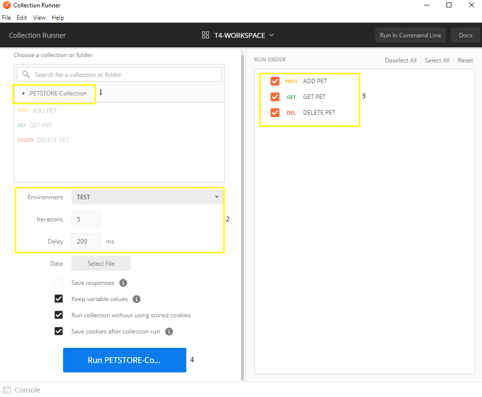
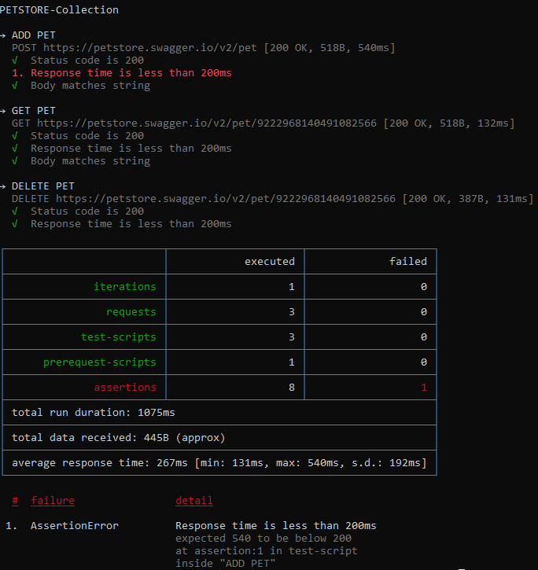

## ¿Qué es POSTMAN ?

Es una **herramienta que permite realizar peticiones HTTP a cualquier API**. Es decir, permite probar, consumir y depurar **REST, SOAP y GraphQL.**  

Postman es una herramienta útil en el desarrollo permitiendo consumir y comprobar el correcto funcionamiento de los servicios que se llevan implementado. En tal sentido, más allá de las funcionalidades mencionadas, este permite organizar las peticiones en colecciones, automatizar pruebas, generar documentación e incluso crear mocks de APIs. 

Sin embargo, Postman tiene una versión de pago con funcionalidades como la monitorización, trabajo sincronizado en equipo, mayor límite de vistas a la documentación, etc que pueden ser muy bien explotadas. Describamos algunas de sus características:

* **Colecciones** 
Postman permite guardar/agrupar un conjunto de solicitudes (request), que se denominan Collections. Estas son carpetas en distintos niveles que organizan nuestras peticiones HTTP.

* **Variables de entorno y globales** 
Las variables nos ayudarán a guardar, recordar un valor para evitar escribir el mismo texto/ruta de forma repetitiva. Por lo que puede ser usado en los request y pruebas posteriores. Así mismo, estas pueden tener un ámbito global o de entorno. 

* **Documentación de APIs** 
Postman genera documentación de forma automática, utilizando la información de las peticiones y las descripciones que hayas introducido al crearlas. Esta puede ser pública o privada, teniendo limitantes en la versión gratuita. 

* **Automatización de pruebas**
Postman permite ejecutar y validar un conjunto de pruebas de forma automatizada utilizando un Collection Runner. Una vez ejecutado, se mostrará el resultado resumen, indicando el tiempo de respuesta y el estado HTTP devuelto por el servidor. Incluso pueden adicionarse add-ons como NewMan, para ejecutar los test en línea de comandos permitiendo trabajar con Jenkins, Travis y Docker.

## ¿Qué es API Rest?


**API REST define un conjunto de funciones para realizar solicitudes (Request) y recibir respuestas (Responses)** a través del protocolo **HTTP** bajo una arquitectura **cliente servidor.**

En efecto, API REST utiliza los métodos HTTP (HTTP verbs) para realizar las peticiones, cada uno tiene una función en particular.
 
* GET solicitar datos o algún recurso.
* HEAD traer headers para obtener información sobre un determinado recurso 
* POST enviar datos a un recurso para la creación.
* PUT reemplazar por completo un recurso.
* PATCH reemplazar parcialmente un recurso.
* DELETE eliminar un recurso.

Los códigos de estado HTTP (HTTP Status Code) describen de forma abreviada la respuesta obtenida en las peticiones. 

* 1XX Respuestas informativas
* 2XX Peticiones correctas
* 3XX Redirecciones
* 4XX Errores del cliente
* 5XX Errores del servidor

### Instalación

Inicialmente Postman fue ideado como una extensión Chrome que aún sigue disponible pero ya está deprecada debido a que cuenta con versiones nativas para Windows, Linux y MacOS. En efecto, debemos descargarlo e instalarlo desde: 

* [https://www.postman.com/downloads/](https://www.postman.com/downloads/)

Postman es gratuito, pero ofrece planes adicionales como Postman Pro con más ancho de banda para las pruebas y Postman Enterprise que puede integrar la herramienta en los sistemas de SSO de nuestra empresa, ambos permiten mayor número de visualizaciones de la documentación publicada de nuestros proyectos. 


Luego de instalarlo, puede usarse únicamente de forma local, pero se recomienda crear una cuenta de usuario para gestionar nuestros request, sincronizarlos y guardarlos en la nube para usarlos más adelante. Así mismo, se pueden crear en equipos de trabajo que permitirán a varios usuarios ver/editar colecciones, request en un mismo workspace compartido.

### PetStore Swagger
Para realizar las pruebas, utilizaremos un API público ejemplo proporcionado por Swagger que se denomina [petstore.swagger.io](https://petstore.swagger.io/). Este no presenta autenticación aunque puede ser configurada si fuera necesario.


En efecto, nos permitirá registrar, actualizar, listar, eliminar usuarios y mascotas. Por otro lado, también permite gestionar las órdenes de compra de mascotas. Para las pruebas nos enfocaremos en las mascotas y particularmente en tres de sus servicios.

* Adicionar nueva mascota (POST /pet)
* Obtener mascota por Id (GET /pet/{petId})
* Eliminar mascota por Id (DELETE /pet/{petId})

Antes de implementar e iniciar cualquier prueba es fundamental explorar el API proporcionado con el fin de tener la mayor información posible.

###### ADICIONAR NUEVA MASCOTA

* URL: http://petstore.swagger.io/v2/pet
* Formato: json
* Método HTTP: POST
* Requiere autenticación: No
* Payload: Objeto Mascota
POST https://petstore.swagger.io/v2/pet

Payload 
```json
{
  "id": 0,
  "category": {
    "id": 0,
    "name": "string"
  },
  "name": "doggie",
  "photoUrls": [
    "string"
  ],
  "tags": [
    {
      "id": 0,
      "name": "string"
    }
  ],
  "status": "available"
}
```
Response
```js
{
    "id": 9222968140491081190,
    "category": {
        "id": 0,
        "name": "string"
    },
    "name": "doggie",
    "photoUrls": [
        "string"
    ],
    "tags": [
        {
            "id": 0,
            "name": "string"
        }
    ],
    "status": "available"
}
```

##### OBTENER MASCOTA POR ID

* URL: https://petstore.swagger.io/v2/pet/{petId}
* Formatos: json
* Método HTTP: GET
* Requiere autenticación: No
* Payload: Ninguno

GET https://petstore.swagger.io/v2/pet/9222968140491081005

Response
```json
{
    "id": 9222968140491081005,
    "category": {
        "id": 0,
        "name": "string"
    },
    "name": "doggie",
    "photoUrls": [
        "string"
    ],
    "tags": [
        {
            "id": 0,
            "name": "string"
        }
    ],
    "status": "available"
}
```
##### ELIMINAR MASCOTA POR ID

* URL: https://petstore.swagger.io/v2/pet/{petId}
* Formatos: json
* Método HTTP: DELETE
* Requiere autenticación: No
* Payload: Ninguno

DELETE https://petstore.swagger.io/v2/pet/9222968140491081004

Response
```json
{
    "code": 200,
    "type": "unknown",
    "message": "9222968140491081004"
}
```
### Implementando Pruebas

Ahora que se conoce la API a ser evaluada, iniciamos Postman seleccionando el workspace de nuestra preferencia donde crearemos las colecciones y peticiones. En este ejemplo, se utilizará el workspace compartido del equipo para que varios usuarios puedan trabajar en el mismo proyecto.


Creamos una nueva colección que agrupara todas las peticiones necesarias para realizar nuestras pruebas. 


PETSTORE-Collection agrupará las peticiones mencionadas anteriormente, nos dirigimos a la opcion Add Requests (petición).


##### Request - ADD PET
Para crear el nuevo request, introducimos el nombre que tendrá junto a una descripción del mismo. La descripción es muy importante porque mientras más detallada/completa sea mejor será la documentación generada.


Posteriormente, se agrega la URL de la petición, indicamos el formato que tiene nuestro payload (en nuestro caso raw - JSON) y adicionamos el body (Pet Object). Una vez llenados correctamente estos campos podemos enviar la petición donde en la parte inferior se puede ver el response generado junto a detalles del mismo como el StatusCode, tiempo de ejecución y tamaño.


Adicionalmente realizamos las pruebas pertinentes, comprobando el StatusCode obtenido, el tiempo de respuesta y evaluando valores del response. Es decir, se implementaran tres pruebas:

* Status code is 200
* Response time is less than 200ms
* Body matches string

```js
let responseBigIntsChangedToStrings = pm.response.text().replace(/([^"\w-])([-0-9.]{8,100})([^"\w-])/g, '$1\"$2\"$3');
let jsonResponse = [...responseBigIntsChangedToStrings.matchAll(/{.*}/g)];
let jsonData = JSON.parse(jsonResponse);

// Saving environment variables
pm.environment.set("idPetToTest", jsonData.id);
pm.environment.set("namePetToTest", jsonData.name);

// Testing ADD PET
pm.test("Status code is 200", function () {
    pm.response.to.have.status(200);
});
pm.test("Response time is less than 200ms", function () {
    pm.expect(pm.response.responseTime).to.be.below(200);
});
pm.test("Body matches string", function () {
    pm.expect(jsonData.name).to.eql("chiki");
    pm.expect(jsonData.status).to.eql("available");
    pm.expect(jsonData.category.name).to.eql("cánidos");
});
```


Finalmente, almacenaremos dos variables de entorno que será usadas en las peticiones posteriores debido a que estas son dinámicas y el utilizar datos estáticos no servirian para automatizar dichas pruebas.
* idPetToTest
* namePetToTest


##### GET PET


##### DELETE PET


#### Variables Globlales


#### Generando Documentación 


* [https://documenter.getpostman.com/view/13536986/TVes6m5R](https://documenter.getpostman.com/view/13536986/TVes6m5R)


#### Ejecutar Pruebas




#### Ejecutar Pruebas desde la terminal con Newman

```sh
npm install -g newman
```





