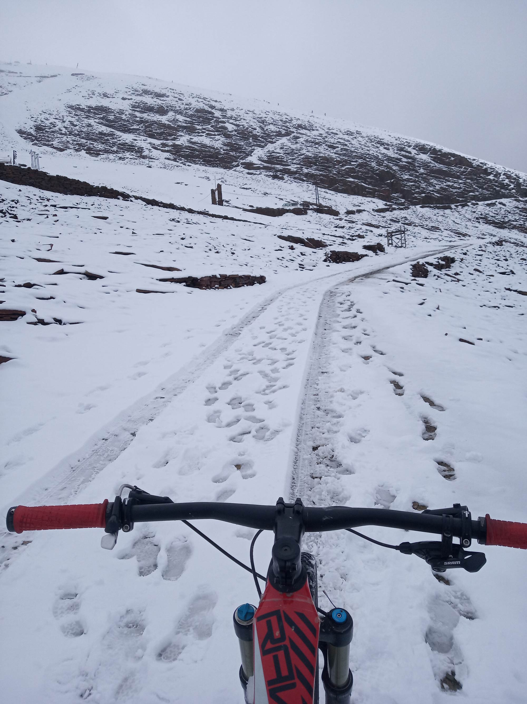

Una de mis rutas favoritas en bicicleta es el Chacaltaya que se encuentra alrededor de los 5200 msnm (5395 msnm la parte más alta), no solo porque está cerca a mi ciudad o es un lugar seguro libre de automóviles y gente. Esta es una de las montañas más difíciles de coronar en la La Paz-Bolivia debido a que requiere cierta técnica para escalar/descender ya que tiene un terreno muy accidentado, que exige muy buena resistencia para llegar de forma continua con un tiempo aceptable ( con una inclinación alrededor del 5%-9%) y requiere mucho coraje.  A pesar de no ser un trayecto demasiado largo las condiciones meteorológicas son muy cambiantes donde el frío es muy fuerte e incluso en días soleados de pronto llueve en la ruta o el viento arremete con fuerza. Por otro lado, el ver solo la montaña ya es intimidante (_Foto Extraida de [Boliviamia.net](https://boliviamia.net/lugares-turisticos/la-paz/chacaltaya)_).  

La característica más notoria de esta ruta es el hecho del pedalear arriba de los 5000 msnm con una saturación de oxígeno incluso del 78% que en muchos otros países se considera una total locura o simplemente se pensaría que no fuese posible. En efecto, probablemente algún extranjero que está acostumbrado a alturas sobre el nivel del mar le costaría demasiado escalar, esto es muy fácil de ver en el fútbol donde equipos de países vecinos llegan con tiempo de anticipación a los encuentros deportivos para tener una buena aclimatación aunque aún así siempre existen quejas al respecto. 

Sin embargo, aún sin considerar el factor de la oxigenación en el ciclista, el Chacaltaya podría ser catalogado como un puerto especial por la gran inclinación que esta presenta si uno parte desde la ciudad de La Paz con un grado de dificultad de 169GD. 

GD=(h/10) + p = (1600/10) + 9 = **169 GD**
* Especial: de 140 a 250 GD
* 1ª: de 80 a 140 GD
* 2ª: de 50 a 80 GD
* 3ª: de 30 a 50 GD
* 4ª: de 20 a 30 GD

 
En efecto, muchos visitantes se quedan muy sorprendidos con la gran altitud a la que muchos ciclistas de La Paz estamos acostumbrados a pedalear, debido a que en el caso de España y Colombia que son potencia en ciclismo tienen puertos muy duros pero estos no superan los 3500 msnm o Japón donde el puerto más alto para competencia es el conocido monte Fuji que tiene 3776 msnm. Pero vamos aún más alla, si lo pensamos bien los paceños (quienes viven en La Paz) estamos a 3600 msnm o nuestros vecinos en El Alto están alrededor de los 4000 msnm. Sin duda es una gran ventaja estar a una altura de estas características y más aún en un terreno tan accidentado ideal para el MTB, obviamente también tiene sus desventajas como el no tener muchas rutas de llano o tener dificultad para competir en áreas más tropicales. 
 
 
Ahora bien algo que hacemos con mis amigos del equipo de MTB para entrenar es ir al Chacaltaya por lo menos una vez al mes de modo que nos reunimos muy temprano alrededor de las 7 am en la CBN que está a la altura de la Terminal de Buses de la ciudad de La Paz que representaria el ingreso al casco viejo de la ciudad. Por ello, empezamos a subir por zonas periféricas, que están muy cerca al bosquecillo de la ciudad, luego de ello se llega a zonas que se encuentran prácticamente en los cerros donde existen subidas demasiado pronunciadas pero si muy satisfactorias luego de terminarlas. Llega un punto en el que no hay más casas pero sí un camino de tierra totalmente vacío, muy tranquilo donde uno pedalea sin distracciones, pensando y disfrutando de tanta calma que se tiene. Luego, se llega a una comunidad denominada 7 lagunas en este punto el pedaleo ya es en poco más llevadero porque los puntos más exigentes ya pasaron y es buen momento de comer o hidratarse para continuar sin más paradas más adelante. 

Luego de ello el siguiente objetivo es ir a Milluni, es un camino de tierra que agota mentalmente porque representa aún la mitad del camino y desde allí las condiciones climáticas van cambiando constantemente por el viento, lluvia y frío. Lo más bonito en ese punto, es que se visualiza toda la familia de nevados que acompañan al Huayna Potosí como una especie de mirador ideal para sacar alguna foto y ver lo imponente de este paisaje que muchas veces esta acompañado de llamas que van pastando por el lugar. Posteriormente,  se llega a la base del chacaltaya donde ya uno tiene que mentalizarse para escalar por tanto terminar de coronar en una ruta que pareciera no acabar con tanta curva, subida que representa en gran reto y a lo lejos en el cielo ya se va viendo la cabaña que fue en algún momento referente del sky como actividad deportiva. Finalmente, luego de subir incansablemente una y otra vez por este camino uno se encuentra con una cruz que representa que ya falta muy poco para llegar, efectivamente se ve una casa grande que en su momento fue en hotel y desde allí es que comienza la última pendiente ya para llegar al final del camino junto a dos cabañas instaladas allí donde finalmente ya se habrá conseguido el objetivo.

 
En los meses de diciembre, enero y febrero llueve mucho en toda Bolivia, pero particularmente en la ciudad de La Paz incluso puede llegar a granizar o nevar. Una de las veces que mas disfrute ir por esta ruta justamente fue en Febrero donde semanas antes llovió mucho lo cual no nos permitan entrenar en equipo como los hacemos cada fin de semana. Hasta que llegó un fin de semana en el que parecía que al fin el sol estaría presente, pero resulto ser momentaneo ya que llovio y llovio demasiado, pero ya con planes de salir todos los amigos cancelaron. No obstante,  yo estaba decidido a ir porque a pesar del frio parecia que no iba a llover por lo que me aventure, fui a la ruta que les comente con anterioridad y la verdad que en en inicio me arrepentí porque el camino estaba demasiado mal, había un río por el tuve que pasar porque cortaba todo el camino pero no hice más que mojar mis zapatos congelando las manos, ya en la parte de arriba para ir a milluni el clima estaba relativamente bien asi que continue subiendo, pero el frío fue incrementando más y más luego casi en las últimas curvas antes de llegar empecé a notar que mucha nieve cayó dia antes lo cual fue algo que nunca había visto por allí, pero sin duda representó algo totalmente distinto a lo que estaba acostumbrado ya con mucho cuidado al momento de subir seguí escalando ya que la nieve era muy resbalosa y no tenía el equipo adecuado para escalar rápidamente.

Llegó un punto en el que la rueda ya no avanzada, también habían vehículos por allí con turistas pero que tampoco se animaban a subir por la cantidad de nieva y quizá por lo peligroso que sería bajar ya en última pendiente, así que cargué la bici y seguí subiendo hasta llegar finalmente a coronar la ruta. 

En la parte de arriba, solo me quede pensando en todo lo que me decían o contaban de el Chacaltaya hace 20 años atrás y como esta fue antes que el calentamiento global le quitara su manto blanco. En efecto, era uno de los lugares más visitados por gente local y de todo el mundo para practicar sky. Pasaron unos 10 minutos o quizá menos pero decidí bajar inmediatamente a pesar que aún quería descansar un poco, esto porque tenía la ropa muy mojada y seguir mas tiempo alli solo seria un paso a la hipotermia por lo que hice lo mejor que podía hacer que es descender muy rápido aprovechando que ya tenía una mejor suspensión en la bicicleta y con muchas ganas de volver a casa a almorzar y tomar algo caliente.
 
 

Fue una de las experiencias más gratificantes no solo por el paisaje si no por la sensación que te da ver el mundo tan hermoso en el que vivimos y tenemos la suerte de conocer. Desde entonces sigo subiendo cada vez que puedo en grupo o solo y tambien si mi estado físico está preparado. Sin embargo, recuerdo más lo que significa esta montaña, es decir estar en el techo del mundo del ciclismo el algo que muy pocos se atreverían a hacer, más aún volver una y otra vez sin perder el gusto ni la satisfacción que representa.
